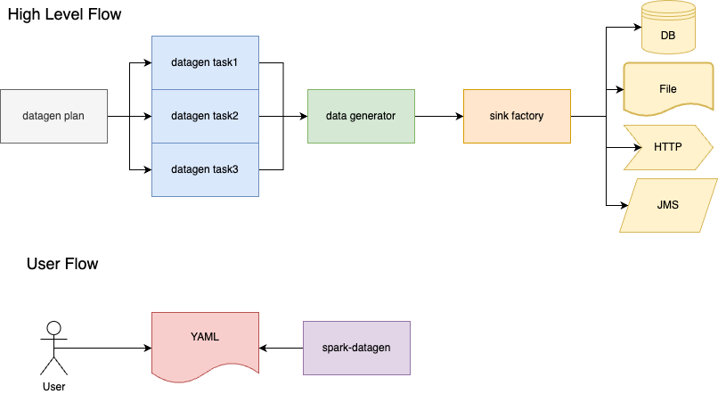

# Spartagen - Data Generator

## Overview

Generator data for databases, files or HTTP request through a YAML based input and executed via Spark.

## Flow



## Generate data
### Quick start
1. Run [App.scala](app/src/main/scala/com/github/pflooky/datagen/App.scala)
2. Check generated data under [here](app/src/test/resources/csv/transactions)

### Manually create data
1. Create plan like [here](app/src/main/resources/plan/customer-create-plan.yaml)
2. Create tasks like [here](app/src/main/resources/task/postgres/postgres-customer-task.yaml)
3. Run job from [here](app/src/main/scala/com/github/pflooky/datagen/App.scala)
   1. Alter [application.conf](app/src/main/resources/application.conf)
      1. Set plan file path to run via environment variable [PLAN_FILE_PATH](app/src/main/resources/application.conf)
      2. Set task folder path via environment variable [TASK_FOLDER_PATH](app/src/main/resources/application.conf)

## Configuration/Customisation
### Datagen plan

[Sample plan](app/src/main/resources/plan/customer-create-plan.yaml)

<details><summary>Detailed summary</summary><br>

```yaml
name: "customer_create_plan"
description: "Create customers in JDBC and Cassandra"
tasks:
  #list of tasks to execute
  - name: "jdbc_customer_accounts_table_create"
    #Name of the data source with configuration as defined in application.conf
    sinkName: "postgres"
  - name: "parquet_transaction_file"
    sinkName: "parquet"
  - name: "cassandra_customer_status_table_create"
    sinkName: "cassandra"
    #Can disable tasks
    enabled: false
  - name: "cassandra_customer_transactions_table_create"
    sinkName: "cassandra"
    enabled: false

sinkOptions:
  #Define a static seed if you want consistent data produced
  seed: "1"
  #Define any foreign keys that should match across data tasks
  foreignKeys:
    #The foreign key name with naming convention [sinkName].[schema].[column name]
    "postgres.accounts.account_number":
      #List of columns to match with same naming convention
      - "parquet.transactions.account_id"
```

</details>

### Datagen Task

[Sample task](app/src/main/resources/task/postgres/postgres-transaction-task.yaml)

<details><summary>Detailed summary</summary><br>

Simple sample

```yaml
name: "jdbc_customer_accounts_table_create"
steps:
  #Define one or more steps within a task
  - name: "accounts"
    type: "postgres"
    count:
      #Number of records to generate
      total: 10
    #Define any Spark options to pass when pushing data
    options:
      dbtable: "account.accounts"
    schema:
      #How to discover the schema: only supports manual for now
      type: "manual"
      fields:
        - name: "account_number"
          #Data type of column: string, int, double, date
          type: "string"
          generator:
            #Type of data generator: regex, random, oneOf
            type: "regex"
            #Options to set per type of generator
            options:
              regex: "ACC1[0-9]{5,10}"
              seed: 1 #Can set the random seed at column level
        - name: "account_status"
          type: "string"
          generator:
            type: "oneOf"
            options:
              #List of potential values
              oneOf:
                - "open"
                - "closed"
        - name: "open_date"
          type: "date"
          generator:
            type: "random"
            #`options` is optional, will revert to defaults if not defined
            options:
              minValue: "2020-01-01" #Default: now() - 5 days
              maxValue: "2022-12-31" #Default: now()
        - name: "created_by"
          type: "string"
          generator:
            type: "random"
            options:
              minLength: 10  #Default: 1
              maxLength: 100 #Default: 20
        - name: "customer_id"
          type: "int"
          generator:
            type: "random"
            options:
              minValue: 0    #Default: 0
              maxValue: 100  #Default: 1
```

With multiple records per foreign key

```yaml
name: "parquet_transaction_file"
steps:
  - name: "transactions"
    type: "parquet"
    options:
      path: "/tmp/sample/parquet/transactions"
    count:
      #Number of records per column to generate
      perColumn:
        #Can be based on multiple columns
        columnNames:
          - "account_id"
        #Can define simple count of records
        count: 10
        #Or define generator for number of records (has to be int generator)
        generator:
          type: "random"
          options:
            minValue: 1
            maxValue: 10
...
```

</details>

### Datagen input

#### Supported data sinks

Spartagen is able to support the following data sinks:

1. Database
   1. JDBC
   2. Cassandra
   3. ElasticSearch
2. HTTP
   1. GET
   2. POST
3. Files (local or S3)
   1. CSV
   2. Parquet
   3. Delta
4. JMS
   1. Solace
   2. ActiveMq

#### Supported use cases

1. Insert into single data sink
2. Insert into multiple data sinks
   1. Foreign keys associated with data sinks
   2. Number of records per column value
3. Set random seed at column level
4. Send events progressively
5. Automatically insert data into database
   1. Read metadata from database and insert for all tables defined

## Challenges

- How to apply foreign keys across datasets
- Providing functions for data generators
- Setting out the Plan -> Task -> Step model
- How to process the data in batches
- Data cleanup after run
  - Save data into parquet files. Can read and delete when needed
  - Have option to truncate/delete directly
- Relationships between fields
  - e.g. if transaction has type purchase, then it is a debit
  - if country is Australia, then country code should be AU

## Resources

https://github.com/apache/spark/blob/master/sql/catalyst/src/test/scala/org/apache/spark/sql/RandomDataGenerator.scala
