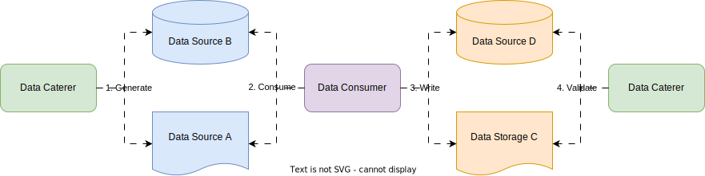
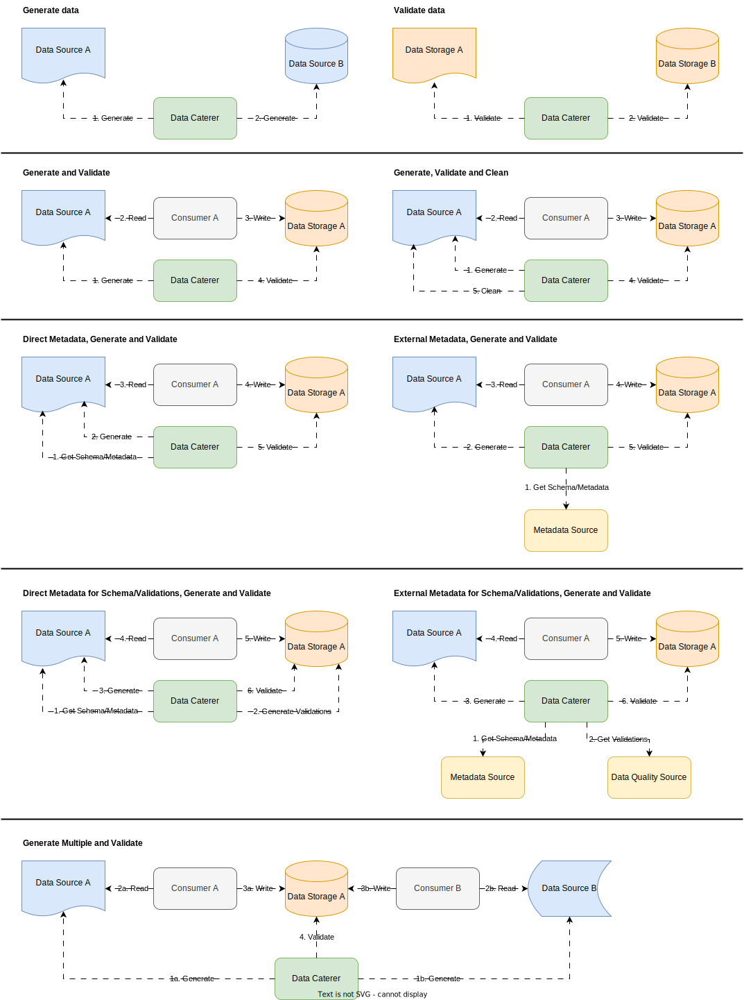

# MOVED TO FOLLOWING REPO: [Data Caterer](https://github.com/data-catering/data-caterer)

# Data Caterer - Data Generation and Validation


## Overview

Generator data for databases, files, JMS or HTTP request through a Scala/Java API or YAML input and executed via Spark.
Run data validations after generating data to ensure it is consumed correctly.

Full docs can be found [**here**](https://data.catering).

## Features

- Metadata discovery
- Batch and/or event data generation
- Maintain referential integrity across any dataset
- Create custom data generation/validation scenarios
- Clean up generated data
- Data validation
- Suggest data validations



## Quick start

```shell
git clone git@github.com:pflooky/data-caterer-example.git
cd data-caterer-example && ./run.sh
#check results under docker/sample/report/index.html folder
```

## Integrations

### Supported data sources

Data Caterer is able to support the following data sources:

1. Database
   1. JDBC
      1. Postgres
      2. MySQL
   2. Cassandra
   3. ElasticSearch (coming soon)
2. Files (local or cloud)
   1. CSV
   2. Parquet
   3. ORC
   4. Delta (coming soon)
   5. JSON
3. HTTP (sponsors only)
4. JMS (sponsors only)
   1. Solace
5. Kafka (sponsors only)

Metadata sources (sponsors only):

1. OpenAPI
2. Marquez (OpenLineage)
3. OpenMetadata

## Supported use cases

1. Insert into single data sink
2. Insert into multiple data sinks
   1. Foreign keys associated between data sources
   2. Number of records per column value
3. Set random seed at column and whole data generation level
4. Generate real looking data (via DataFaker) and edge cases
   1. Names, addresses, places etc.
   2. Edge cases for each data type (e.g. newline character in string, maximum integer, NaN, 0)
   3. Nullability
5. Send events progressively
6. Automatically insert data into data source
   1. Read metadata from data source and insert for all sub data sources (e.g. tables)
   2. Get statistics from existing data in data source if exists
7. Track and delete generated data
8. Extract data profiling and metadata from given data sources
   1. Calculate the total number of combinations
9. Validate data
   1. Basic column validations (not null, contains, equals, greater than)
   2. Aggregate validations (group by account_id and sum amounts should be less than 100, each account should have at
      least one transaction)
   3. Upstream data source validations (generate data and then check same data is inserted in another data source with
      potential transformations)

## Run Configurations

Different ways to run Data Caterer based on your use case:



## Sponsorship

Data Caterer is set up under a sponsorware model where all features are available to sponsors. A subset of the features
are available here in this project for all to use/fork/update/improve etc., as the open core.

Sponsors have access to the following features:

- Metadata discovery
- All data sources (see [here for all data sources](https://data.catering/setup/connection/connection/))
- Batch and :material-circle-multiple: Event generation
- Auto generation from data connections or metadata sources
- Suggest data validations
- Clean up generated data
- Run as many times as you want, not charged by usage
plus [more the come](#roadmap).

[Find out more details here to help with sponsorship.](https://data.catering/sponsor)

This is inspired by the [mkdocs-material project](https://github.com/squidfunk/mkdocs-material) which
[follows the same model](https://squidfunk.github.io/mkdocs-material/insiders/).

## Additional Details

### High Level Flow


### Roadmap

[Can check here for full list.](https://data.catering/use-case/roadmap/)

### Challenges

- How to apply foreign keys across datasets
- Providing functions for data generators
- Setting out the Plan -> Task -> Step model
- How to process the data in batches
- Data cleanup after run
  - Save data into parquet files. Can read and delete when needed
  - Have option to delete directly
  - Have to do in particular order due to foreign keys
- Relationships/constraints between fields
  - e.g. if transaction has type purchase, then it is a debit
  - if country is Australia, then country code should be AU
  - could be one to one, one to many, many to many mapping
- Predict the type of string expression to use from DataFaker
  - Utilise the metadata for the field
- Having intermediate fields and not including them into the output
  - Allow for SQL expressions
- Issues with spark streaming to write real-time data
  - Using rate format, have to manage the connection to the data source yourself
  - Connection per batch, stopped working for Solace after 125 messages (5 per second)
- Generating regex pattern given data samples
- Database generated columns values
  - Auto increment
  - On update current_timestamp
  - Omit generating columns (only if they are not used as foreign keys)
- Metadata storage and referencing
  - How will it interact with a data dictionary?
  - Updated schema/metadata

### Resources

[Spark test data generator](https://github.com/apache/spark/blob/master/sql/catalyst/src/test/scala/org/apache/spark/sql/RandomDataGenerator.scala)

### Java 17 VM Options

```shell
--add-opens=java.base/java.lang=ALL-UNNAMED --add-opens=java.base/java.lang.invoke=ALL-UNNAMED --add-opens=java.base/java.lang.reflect=ALL-UNNAMED --add-opens=java.base/java.io=ALL-UNNAMED --add-opens=java.base/java.net=ALL-UNNAMED --add-opens=java.base/java.nio=ALL-UNNAMED --add-opens=java.base/java.util=ALL-UNNAMED --add-opens=java.base/java.util.concurrent=ALL-UNNAMED --add-opens=java.base/java.util.concurrent.atomic=ALL-UNNAMED --add-opens=java.base/sun.nio.ch=ALL-UNNAMED --add-opens=java.base/sun.nio.cs=ALL-UNNAMED --add-opens=java.base/sun.security.action=ALL-UNNAMED --add-opens=java.base/sun.util.calendar=ALL-UNNAMED --add-opens=java.security.jgss/sun.security.krb5=ALL-UNNAMED
```
