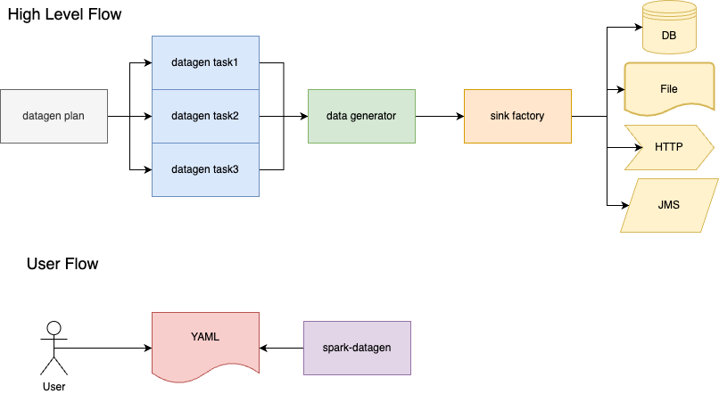

# Draven - spark-datagen
## Overview
Generator data for databases, files or HTTP request through a YAML based input and executed via Spark.

## Flow

## How to use
1. Input data into YAML
2. Run job

### Datagen Input
#### Supported Data Sinks
Draven is able to support the following data sinks:
1. Database
   1. JDBC
   2. Cassandra
   3. ElasticSearch
2. HTTP
   1. GET
   2. POST
3. Files (local or S3)
   1. CSV
   2. Parquet
   3. Delta
4. JMS
   1. Solace
   2. ActiveMq

#### Supported Use Cases
1. Insert into single data sink
2. Insert into multiple data sinks
   1. Foreign keys associated with data sinks
   2. Number of records per column value
3. Send events progressively
4. Automatically insert data into database

## Challenges
- How to apply foreign keys across datasets
- Providing functions for data generators
- Setting out the Plan -> Task -> Step model
- How to process the data in batches
- Data cleanup after run

## Resources
https://github.com/apache/spark/blob/master/sql/catalyst/src/test/scala/org/apache/spark/sql/RandomDataGenerator.scala
