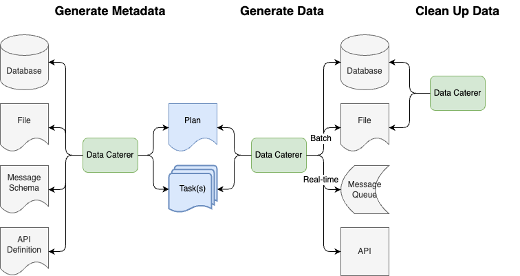
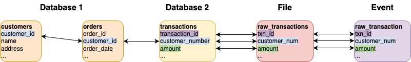

# Spartagen - Data Generator

## Overview

Ability to generate production like data based on any source/target system whether it be a CSV file, database table, etc.
It can also be manually altered to produce data the way you want leveraging [datafaker](https://www.datafaker.net/documentation/getting-started/).



## Generate data

### Quick start

#### Docker

1. `docker run -v /tmp:/opt/app/spartagen pflookyy/spartagen:0.1`
2. Check `/tmp` folder for generated JSON data

#### App

1. Run [App.scala](../app/src/main/scala/com/github/pflooky/datagen/App.scala)
2. Check generated data under [here](../app/src/test/resources/csv/transactions)

### Manually create data

1. Create plan like [here](../app/src/main/resources/plan/customer-create-plan.yaml)
2. Create tasks like [here](../app/src/main/resources/task/postgres/postgres-customer-task.yaml)
3. Run job from [here](../app/src/main/scala/com/github/pflooky/datagen/App.scala)
   1. Alter [application.conf](../app/src/main/resources/application.conf) if you have any data source/target configurations
      1. Set plan file path to run via environment variable [PLAN_FILE_PATH](../app/src/main/resources/application.conf)
      2. Set task folder path via environment variable [TASK_FOLDER_PATH](../app/src/main/resources/application.conf)

### Advanced use cases

#### Foreign keys across data sets

  
If you have a use case where you require a columns value to match in another data set, this can be achieved in the plan definition.
For example, if I have the column `account_number` in a data source named `customer-postgres` and column `account_id` in `transaction-cassandra`,
```yaml
sinkOptions:
  foreignKeys:
    #The foreign key name with naming convention [dataSourceName].[schema].[columnName]
    "customer-postgres.accounts.account_number":
      #List of columns to match with same naming convention
      - "transaction-cassandra.transactions.account_id"
```
  
You can define any number of foreign key relationships as you want.

#### Edge cases

For each given data type, there are edge cases which can cause issues when your application processes the data.
This can be controlled at a column level by including the following flag in the generator options:
```yaml
fields:
  - name: "amount"
    type: "double"
    generator:
      type: "random"
      options:
        enableEdgeCases: "true" 
```

If you want to know all the possible edge cases for each data type, [can check the documentation here](tech/generators.md).  

#### Scenario testing

You can create specific scenarios by adjusting the metadata found in the plan and tasks to your liking.  
For example, if you had two data sources, a Postgres database and a parquet file, and you wanted to save account data into Postgres and 
transactions into the parquet file. You can alter the `status` column in the account data to only generate `open` accounts 
and define a foreign key between Postgres and parquet to ensure the same `account_id` is being used.  
Then in the parquet task, define 1 to 10 transactions per `account_id` to be generated.

[Account generation example task](../app/src/main/resources/task/file/parquet-transaction-task.yaml)  
[Transaction generation example task](../app/src/main/resources/task/postgres/postgres-customer-task.yaml)  
[Plan](../app/src/main/resources/plan/example-account-create-plan.yaml)  

#### Generating JSON data